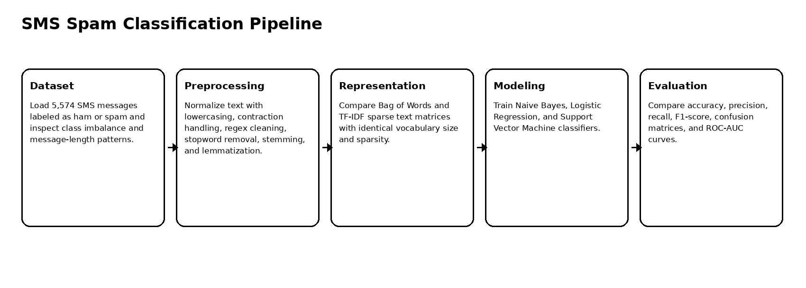
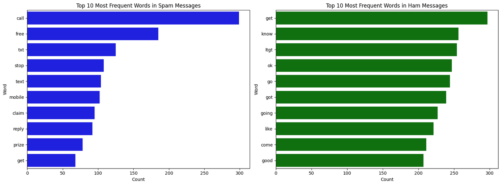
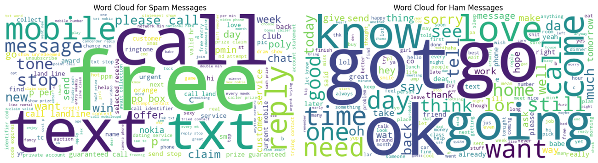
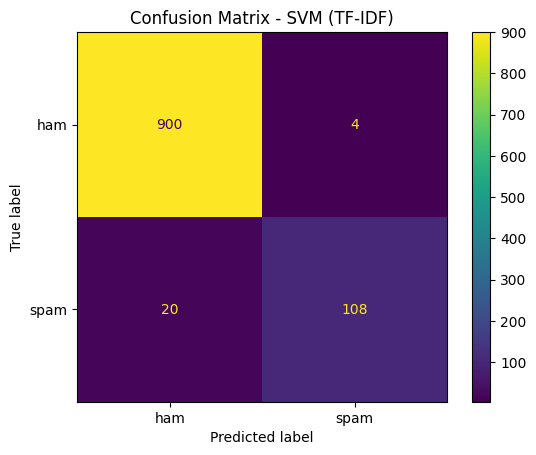
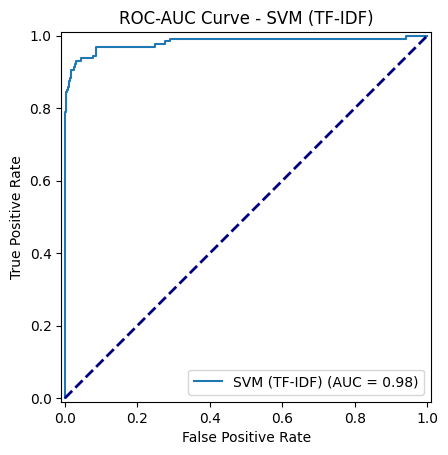
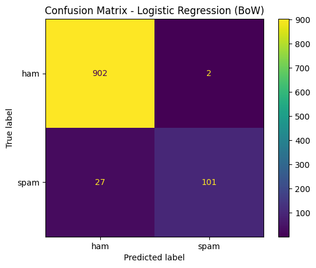

# SMS Spam Classification with Traditional NLP Models

Traditional NLP spam-detection workflow using SMS text preprocessing, Bag of Words, TF-IDF, Naive Bayes, Logistic Regression, Support Vector Machine, confusion matrices, and ROC-AUC analysis.

## Overview

This project builds a machine learning pipeline for classifying SMS messages as **ham** or **spam**. It compares classical text representations and classifiers to understand which combination performs best for spam detection.

The best-performing configuration was **SVM with TF-IDF**, achieving **97.67% accuracy** and **0.90 spam F1-score**.

## Dataset

| Item | Value |
|---|---:|
| SMS messages | 5,574 |
| Ham messages | 4,827 |
| Spam messages | 747 |
| Task | Binary text classification |
| Representations | Bag of Words, TF-IDF |
| Vocabulary features | 6,879 |
| Matrix sparsity | 0.9989 |

## Pipeline



## Exploratory Analysis

| Word clouds | Message length distribution |
|---|---|
|  |  |

## Model Comparison

| Model | Representation | Accuracy | Spam Recall | Spam F1 |
|---|---|---:|---:|---:|
| Naive Bayes | BoW | 0.9738 | 0.88 | 0.89 |
| Naive Bayes | TF-IDF | 0.9564 | 0.66 | 0.79 |
| Logistic Regression | BoW | 0.9719 | 0.79 | 0.87 |
| Logistic Regression | TF-IDF | 0.9506 | 0.62 | 0.76 |
| SVM | BoW | 0.9738 | 0.81 | 0.89 |
| SVM | TF-IDF | 0.9767 | 0.84 | 0.90 |

## Visual Evaluation

| SVM + TF-IDF confusion matrix | SVM + TF-IDF ROC curve |
|---|---|
|  |  |

| Naive Bayes + BoW | Logistic Regression + BoW |
|---|---|
|  |  |

## Key Findings

1. The SMS dataset is imbalanced, with ham messages dominating the dataset.
2. All strong models achieved high overall accuracy, but spam recall varied significantly.
3. SVM with TF-IDF achieved the best overall accuracy and spam F1-score.
4. Bag of Words performed competitively and sometimes produced better spam recall.
5. TF-IDF improved ranking/separation behavior but could reduce spam recall for some models.
6. Spam detection should prioritize recall and F1-score, not accuracy alone.

## Repository Structure

```text
.
├── sms_spam_traditional_nlp_classification.ipynb
├── src/
│   └── train.py
├── docs/
│   └── figures/
├── results/
│   ├── dataset_summary.json
│   └── model_comparison.csv
├── requirements.txt
├── .gitignore
└── README.md
```

## Run Locally

Create a clean Python environment and install the dependencies.

### Windows PowerShell

```powershell
py -3.10 -m venv .venv
.\.venv\Scripts\Activate.ps1
python -m pip install --upgrade pip
pip install -r requirements.txt
```

### Linux / macOS

```bash
python3 -m venv .venv
source .venv/bin/activate
python -m pip install --upgrade pip
pip install -r requirements.txt
```


## Dataset Setup

Place the SMS dataset at:

```text
data/sms_spam.csv
```

## Open the Notebook

```bash
jupyter notebook sms_spam_traditional_nlp_classification.ipynb
```

## Optional Script Usage

```bash
python src/train.py --data data/sms_spam.csv --representation tfidf
```
